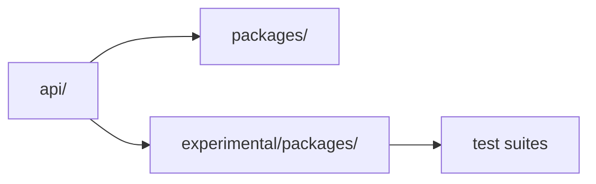
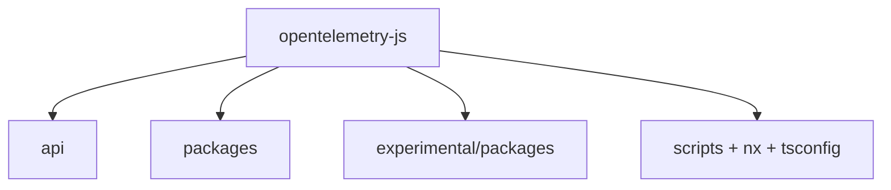
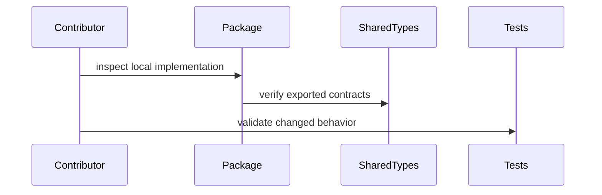

# opentelemetry-js

## Overview
This monorepo splits public API, stable packages, and experimental packages. Start from the package boundary, then trace outward to shared API types and processor/exporter call sites before editing behavior.

## Key Components
- `api/`: API-layer contracts shared across packages.
- `packages/`: stable SDK and instrumentation packages.
- `experimental/packages/`: incubating packages, including `sdk-logs`.
- `scripts/`: repo-wide maintenance and release helpers.

## Diagrams (Mermaid)

### Flowchart

### Component Diagram

### Sequence Diagram

