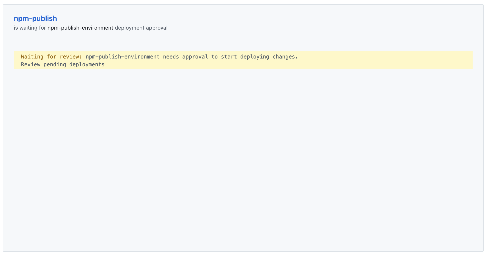
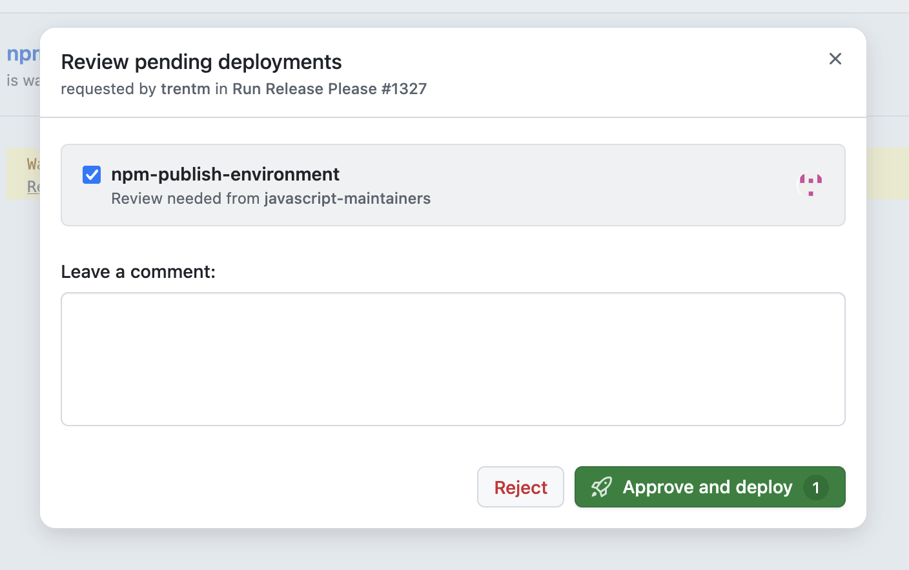

# Releasing

This document is aimed at Maintainers and describes how to release a new version of the packages contained in this repository.
We aim to eventually automate this process as much as possible.

> [!IMPORTANT]
> You must have another maintainer approve the deployment to NPM. Make sure to coordinate with them before starting the release process.
> Never approve deployments that were not coordinated with you ahead of time.

## 1. Create a release PR

1. Go to the [Release PR Workflow](https://github.com/open-telemetry/opentelemetry-js/actions/workflows/create-or-update-release-pr.yml)
2. Click "Run workflow"
3. For `Release Type`, select if you want to create a release PR for a new `minor` or `patch` version.
4. For `Release Scope`, select if you want to release
   - `experimental` (all packages under `./experimental/packages`)
   - `sdk` (all packages under `./packages/` and `./experimental/packages`)
   - `all` (all packages under `./api/`, `./packages/` and `./experimental/packages`; excludes `./semantic-conventions/`)
   - `semconv` (the single semconv package at `./semantic-conventions/`)

> [!TIP]
> If there was a commit to `main`, after PR creation simply run the workflow again before merging it.
> Re-running it will update the PR with the contents from `main` and will update the PR body too.

## 2. Review and merge the release PR

1. Review the PR generated via the workflow (it will be titled `chore: prepare next release` and opened by [otelbot[bot]](https://github.com/apps/otelbot))
2. Once approved, merge the PR

## 3. Publish to NPM

> [!IMPORTANT]
> This step will publish anything that's on `main` IF AND ONLY IF the version has been bumped. If the version for a package
> has not been bumped, it will not publish a new version of the package.

1. Go to the [NPM publish workflow](https://github.com/open-telemetry/opentelemetry-js/actions/workflows/publish-to-npm.yml)
2. Click "Run workflow" (from main)
3. Get another maintainer to approve the workflow run
   1. Have them navigate to the workflow run, and then click on "Review pending deployments" 
   2. They should then check the box and select "Approve and deploy"  to approve the deployment to NPM.

## 4. Troubleshooting NPM publishing issues

> [!NOTE]
> You can skip this step if the `publish-to-npm` workflow completed successfully.

- New packages that have never been published before cannot be published this way - contact an `@opentelemetry` org Admin to publish them manually.
- In rare cases not all packages are published due to a race when publishing, if you suspect this to be the case, re-run the workflow.
  This will only publish packages that failed to publish the first time around. Repeat [Step 3: Publish to NPM](#3-publish-to-npm) until all packages are published.

## 5. Create GitHub Releases

1. Check out the commit created by merging the release PR
2. Run
   - `npm run _github:draft_release:experimental`, if you published an `all`, `sdk` or `experimental` release
   - `npm run _github:draft_release:stable`, if you published an `all` or `sdk` release
   - `npm run _github:draft_release:semconv`, if you published a `semconv` release
   - `npm run _github:draft_release:api` if you published an `all` release
3. Verify that the contents of the created draft releases (title, changelog, selected commit)
4. Publish the releases
   - uncheck `Set as a pre-release` for all releases
   - uncheck `Set as the latest release` for all releases except for the `stable` SDK release. This will ensure that the
     `stable` SDK release consistently shows up as latest under `Releases` when navigating to the project page.
