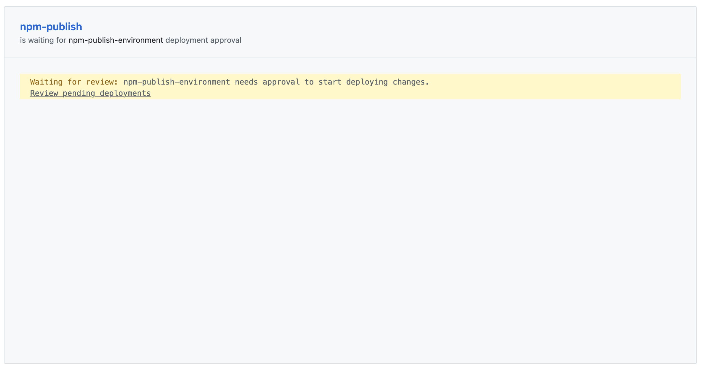
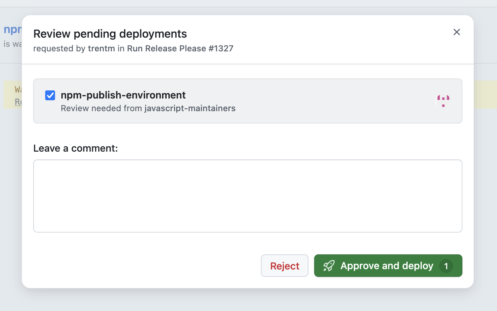

# Releasing

This document is aimed at Maintainers and describes how to release a new version of the packages contained in this repository.
We aim to eventually automate this process as much as possible.

> [!IMPORTANT]
> You must have another maintainer approve the deployment to NPM. Make sure to coordinate with them before starting the release process.
> Never approve deployments that were not coordinated with you ahead of time.

## 1. Create a release PR

1. Go to the [Release PR Workflow](https://github.com/open-telemetry/opentelemetry-js/actions/workflows/create-or-update-release-pr.yml)
2. Click "Run workflow" and pick the branch you are releasing under "Use workflow from" -
   `main`, or a maintenance branch such as `v2.x` (see [Maintenance branches](#maintenance-branches)).
   Each branch has its own release PR, so the two never interfere.
3. Configure which packages to release and their version bump type:
   - **Stable SDK packages** (`./packages/*`): Select `major`, `minor`, `patch`, or `inherit` (no release unless required)
   - **Experimental packages** (`./experimental/packages/*`): Select `minor`, `patch`, or `inherit` (automatically inherits from Stable SDK if Stable SDK is released)
   - **API package** (`./api`): Select `minor`, `patch`, or `inherit` (no release). When set, makes Stable SDK and Experimental packages inherit the same version bump.
   - **Semantic Conventions** (`./semantic-conventions`): Select `minor`, `patch`, or `inherit` (no release)
   - **Pre-release identifier**: Select `development`, `rc`, or `none` (a normal release). See [Pre-releases](#pre-releases).

**Release Rules:**

- If you release Stable SDK packages, Experimental packages will automatically inherit the same version bump type (unless you explicitly set Experimental to a different value)
- If you use "API package", it will make both Stable SDK and Experimental packages inherit the same version bump
- You cannot set "API package" to a specific version while also setting Stable SDK or Experimental to different bumps (the workflow will fail)
- Semantic Conventions can be released independently or alongside other packages
- `major` is only offered for Stable SDK packages. Experimental packages inherit it as a
  `minor` bump, because they track the stable SDK generation in their minor version
  (`2.x` ↔ `0.2xx.x`, see [the upgrade guide](../upgrade-to-2.x.md)) — a stable `3.0.0`
  means an experimental `0.222.0`, not `1.0.0`.

### Pre-releases

Setting a **pre-release identifier** produces a pre-release version, which the publish
workflow puts on the `canary` npm dist-tag instead of `latest` — so it is only installed
by users who explicitly opt in (`npm install @opentelemetry/sdk-trace-node@canary`). This
is how pre-releases of the next major version are cut from `main` while it is still being
developed.

The identifier is a *modifier*: it changes how the packages you selected above are
bumped, but it does not select any package on its own.

There are two identifiers:

- **`development`** — for releasing on a regular cadence off `main`, while the next
  major version is still being built.
- **`rc`** — for release candidates, once the release is close to final.

| Starting from | Bump | Identifier | Result |
| --- | --- | --- | --- |
| `2.10.0` | `major` | `development` | `3.0.0-development.0` |
| `3.0.0-development.0` | `major` | `development` | `3.0.0-development.1` |
| `3.0.0-development.7` | `major` | `rc` | `3.0.0-rc.0` |
| `3.0.0-rc.2` | `major` | `none` | `3.0.0` |

To iterate, re-run the workflow with the **same** bump type and identifier — only the
trailing counter moves. To promote a `development` stream to `rc`, keep the bump type and
switch the identifier. To finalize, keep the bump type and set the identifier back to
`none`; the pre-release suffix is dropped, and because the version is no longer a
pre-release the packages go back to the `latest` dist-tag.

So a full 3.0.0 cycle looks like:

```text
3.0.0-development.0 ... 3.0.0-development.42  ->  3.0.0-rc.0 ... 3.0.0-rc.2  ->  3.0.0
```

> [!IMPORTANT]
> Keep the same bump type for the whole pre-release cycle, and only move the identifier
> forward. The workflow fails with an explanatory error rather than publishing either of
> these:
>
> - Switching the bump type — finalizing a `3.0.0-rc.2` with `minor` instead of `major`
>   produces a different version and abandons the release that is in flight.
> - Going back to `development` from `rc` — npm compares identifiers as strings, so
>   `development` sorts before `rc` and this would be a *downgrade*, producing a version
>   lower than what is already published.

**Not supported for pre-releases:**

- The **API package** and **Semantic Conventions**. Both are depended on through version
  *ranges* (`^1.29.0`, `>=1.0.0 <1.10.0`) rather than exact pins, and a pre-release
  version does not satisfy such a range — npm would resolve those dependencies to the
  last published release from the registry instead of linking the local workspace copy.
  The API additionally bans pre-release versions outright, because
  `@opentelemetry/api` requires an exact version match when either side carries a
  pre-release tag. Release these packages separately, as normal releases.
- Cutting a **normal** Experimental release while the Stable SDK is mid-pre-release.
  Experimental packages pin stable SDK packages exactly, so this would publish a stable
  version depending on a pre-release. Finalize the Stable SDK first.

### Maintenance branches

Once the next major version is being developed on `main`, the previous major keeps getting
patch and minor releases from a maintenance branch named after it: `v2.x` for the `2.x`
stable SDK line, and the `0.2xx.x` experimental line that tracks it. The `v` prefix matters -
the repository's "release branches" ruleset targets `refs/heads/v[0-9]*.*`, so a branch named
`2.x` would have no protections at all.

The workflows and inputs are the same as for `main`, with three differences:

1. **Dispatch both workflows from the maintenance branch.** The branch decides which release
   line is bumped, which release PR is updated, and which npm dist-tag the packages end up
   under. Dispatching either workflow from a branch we do not release from fails.
2. **The release PR is a separate one.** `main` uses the head branch
   `otelbot/prepare-next-version`; `v2.x` uses `otelbot/prepare-next-version-v2.x` and the PR
   is titled `chore: prepare next v2.x release`. Both can be open at the same time.
3. **The packages are published under a `latest-<major>` dist-tag rather than `latest`**, so
   that a `2.10.1` published after a `3.0.0-development.4` does not pull `latest` back to the
   older line. This follows the same convention as `express` (`latest` / `latest-4`). Users
   opt in with `npm install @opentelemetry/sdk-trace-node@latest-2`.

Publishing the GitHub release does **not** redeploy the API documentation site for a
maintenance release. The site is built from a single tree and force-pushed to `gh-pages`, so
it can only track one release line; `docs.yaml` skips the deploy unless the released commit is
reachable from `main`.

| Branch | `dist_tag` input | Stable release goes to | Pre-release goes to |
| --- | --- | --- | --- |
| `main` | `auto` | `latest` | `canary` |
| `v2.x` | `auto` | `latest-2` | n/a - not supported, see below |
| `v2.x` | `latest` | `latest` | n/a - not supported, see below |

The publish workflow still passes a `canary-2` pre-dist-tag along on a maintenance branch,
but only as a backstop: `lerna publish` applies it per package and only to versions that are
pre-releases, and the release PR workflow refuses to mint one here in the first place. Should
a `2.11.0-rc.0` reach the publish workflow anyway, that scoping keeps it off `canary`.

> [!IMPORTANT]
> While `main` publishes nothing but pre-releases, no release claims `latest` and it stays
> pinned to the last release cut before the branch existed - so a plain `npm install` would
> never pick up the maintenance fixes. **Until the next major is released, dispatch the
> publish workflow from the maintenance branch with the `dist_tag` input set to `latest`.**
> Switch back to `auto` once the new major has shipped and holds `latest` itself. The publish
> workflow prints a reminder in the "Resolve npm dist-tags" step whenever a release is about
> to skip `latest`.

**Not supported from a maintenance branch.** The release PR workflow fails with an
explanatory error rather than producing any of these:

- A **`major`** bump - `v2.x` only releases `2.x` versions, a new major is released from `main`.
- A **pre-release identifier** - maintenance releases are always normal releases, and a
  pre-release cut here would compete for `main`'s pre-release dist-tag.
- An **API** or **Semantic Conventions** release. Both are on a single version line shared by
  every branch and independent of the SDK major, so `main` still carries the very same line;
  from a maintenance branch they would be published under `latest-2` instead of `latest`.
  Release them from `main`.

#### Cutting a maintenance branch

Before the first release from a new maintenance branch:

1. Cut the branch from the last release of that major (e.g. `v2.x` from the `v2.10.0` tag).
2. **Reserve the experimental version band on `main`.** Experimental packages have no major
   of their own, so both branches would otherwise mint `0.2xx.x` versions. If a version has
   already been published from the other branch, `lerna publish from-package` *silently skips*
   those packages and the workflow still succeeds - a partial release with no error. Do the
   manual vanity bump on `main` (e.g. `0.221.0` -> `0.300.0`, see the note on vanity bumps in
   the release rules above) so the two lines cannot overlap.
3. **Add the branch to the `npm-publish-environment` deployment branch policy** (repository
   settings -> Environments). It is restricted to an explicit list of branches, and a
   `workflow_dispatch` from any other branch is rejected before the first step runs.
4. Make sure the release automation itself is on the branch. `workflow_dispatch` runs the copy
   of the workflow file that lives on the selected branch, so the workflows and
   `scripts/` need to be cherry-picked over.

> [!TIP]
> If there was a commit to the release branch, after PR creation simply run the workflow again before merging it.
> Re-running it will update the PR with the contents of the release branch and will update the PR body too.

## 2. Review and merge the release PR

1. Review the PR generated via the workflow (it will be titled `chore: prepare next release` and opened by [otelbot[bot]](https://github.com/apps/otelbot))
2. Once approved, merge the PR

## 3. Publish to NPM

> [!IMPORTANT]
> This step will publish anything that's on the branch you run it from IF AND ONLY IF the version has been bumped.
> If the version for a package has not been bumped, it will not publish a new version of the package.

1. Go to the [NPM publish workflow](https://github.com/open-telemetry/opentelemetry-js/actions/workflows/publish-to-npm.yml)
2. Click "Run workflow" and select the branch you released - the same one you created the release PR from
   - On `main`, leave **`dist_tag`** at `auto`
   - On a maintenance branch, see [Maintenance branches](#maintenance-branches) - while the
     next major is still unreleased, this needs to be set to `latest`
3. Get another maintainer to approve the workflow run
   1. Have them navigate to the workflow run, and then click on "Review pending deployments" 
   2. They should then check the box and select "Approve and deploy"  to approve the deployment to NPM.

## 4. Troubleshooting NPM publishing issues

> [!NOTE]
> You can skip this step if the `publish-to-npm` workflow completed successfully.

- New packages that have never been published before cannot be published this way - contact an `@opentelemetry` org Admin to publish them manually.
- In rare cases not all packages are published due to a race when publishing, if you suspect this to be the case, re-run the workflow.
  This will only publish packages that failed to publish the first time around. Repeat [Step 3: Publish to NPM](#3-publish-to-npm) until all packages are published.

## 5. Create GitHub Releases

1. Check out the commit created by merging the release PR
2. Run
   - `npm run _github:draft_release:experimental`, if you published an `api`, `sdk` or `experimental` release
   - `npm run _github:draft_release:stable`, if you published an `api` or `sdk` release
   - `npm run _github:draft_release:semconv`, if you published a `semconv` release
   - `npm run _github:draft_release:api` if you published an `api` release
3. Verify that the contents of the created draft releases (title, changelog, selected commit)
4. Publish the releases
   - If you released with a pre-release identifier, the draft is already marked as a
     pre-release; leave `Pre-release` set for the `Release label`.
   - If you published a stable `sdk` release from `main`, set `Latest` for the `Release label`.
     This will ensure that the `stable` SDK release consistently shows up as latest under `Releases` when navigating to the project page.
   - If you released from a maintenance branch, set `None` - GitHub picks its automatic
     "latest" by creation date, so a `2.10.1` released after a `3.0.0` pre-release would
     otherwise claim it. (The API documentation site is left alone either way, see
     [Maintenance branches](#maintenance-branches).)
   - For all other releases, set `None` for the `Release label`.
