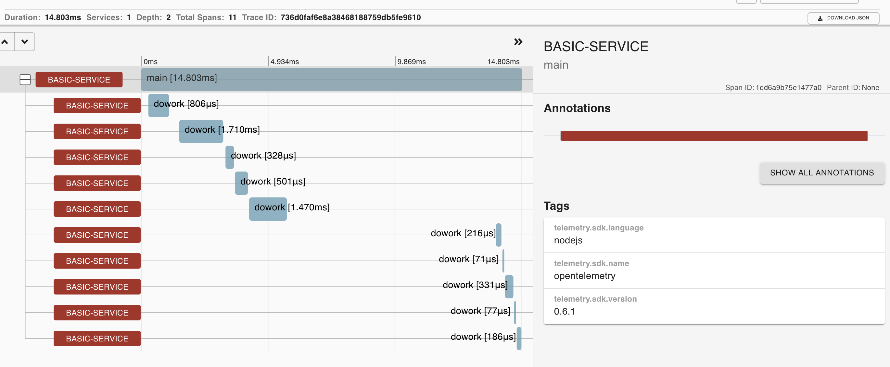

# Overview

This example shows how to use [@opentelemetry/exporter-collector](https://github.com/open-telemetry/opentelemetry-js/tree/master/packages/opentelemetry-exporter-collector) to instrument a simple Node.js application.

This example will export spans data simultaneously using [Exporter Collector](https://github.com/open-telemetry/opentelemetry-js/tree/master/packages/opentelemetry-exporter-collector) and grpc. It will use [proto format](https://github.com/open-telemetry/opentelemetry-proto).

## Installation

```shell script
# from this directory
npm install
```

## Run the Application

1. Run docker

    ```shell script
    # from this directory
    npm run docker:start
    ```

2. Run tracing app

    ```shell script
    # from this directory
    npm start:tracing
    ```

3. Run metrics app

    ```shell script
    # from this directory
    npm start:metrics
    ```

4. Open page at <http://localhost:9411/zipkin/> -  you should be able to see the spans in zipkin


### Prometheus UI

The prometheus client will be available at <http://localhost:9090>.

Note: It may take some time for the application metrics to appear on the Prometheus dashboard.

<p align="center"></p>
<p align="center"></p>

## Useful links

- For more information on OpenTelemetry, visit: <https://opentelemetry.io/>
- For more information on tracing, visit: <https://github.com/open-telemetry/opentelemetry-js/tree/master/packages/opentelemetry-tracing>

## LICENSE

Apache License 2.0
