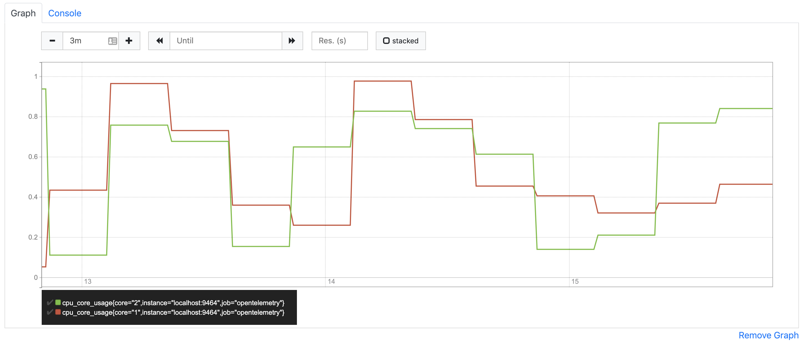

# Overview

OpenTelemetry metrics allow a user to collect data and export it to a metrics backend like Prometheus.

This is a simple example that demonstrates basic metrics collection and exports those metrics to a Prometheus compatible endpoint.

## Installation

```sh
$ # from this directory
$ npm install
```

How to setup [Prometheus](https://prometheus.io/docs/prometheus/latest/getting_started/) please check
[Setup Prometheus](https://github.com/open-telemetry/opentelemetry-js/tree/master/packages/opentelemetry-exporter-prometheus)

## Run the Application
- Run the example

### Observer
```sh
$ npm run start:observer
```

### Prometheus
1. In prometheus search for "metric_observer"

### Links
1. Prometheus Scrape Endpoint http://localhost:9464/metrics
2. Prometheus graph http://localhost:9090/graph

### Example
<p align="center"></p>

## Useful links
- For more information on OpenTelemetry, visit: <https://opentelemetry.io/>
- For more information on OpenTelemetry metrics, visit: <https://github.com/open-telemetry/opentelemetry-js/tree/master/packages/opentelemetry-metrics>

## LICENSE

Apache License 2.0
