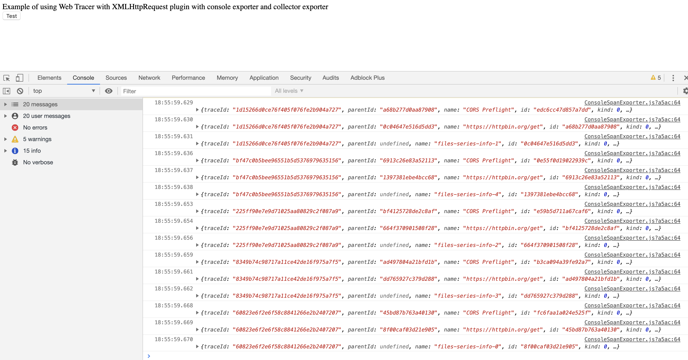

# Overview

This example shows how to
use [@opentelemetry/sdk-trace-web](https://github.com/open-telemetry/opentelemetry-js/tree/main/packages/opentelemetry-sdk-trace-web)
with different plugins and setup to instrument your JavaScript code running in the browser.

## Installation

```sh
# from this directory
npm install
```

## Run the Application

```sh
# from this directory
npm start
```

By default, the application will run on port `8090`.

Other options for running the application, this serves the same examples using different source file processing, so you
can review the different effects on the resulting bundle sizes that are loaded via the browser.

| Command                | Description                                               |
| ---------------------- | --------------------------------------------------------- |
| `npm start` (Default)  | Serve the raw development bundles compressed via GZip     |
| `npm run start-nc`     | Serve the raw development bundles uncompressed            |
| `npm run start-prod`   | Serve the minified production bundles compressed via GZip |
| `npm run start-prodnc` | Serve the minified production bundles uncompressed        |

The development modes includes source maps via the webpack devtool `eval-source-map` mode which substantially increases
the size of the bundles.

## Examples

The examples include several variants so that you can see how to mix and match individual components and the impact this
can have on the resulting bundle size.

### XMLHttpRequest

This example shows how to use the XMLHttpRequest Instrumentation with the OTLP (`http/json`) Trace exporter and with the
B3 Propagator.

Included Components

- XMLHttpRequestInstrumentation
- ZoneContextManager
- OTLPTraceExporter
- WebTracerProvider
- B3Propagator

To see the results, open the browser at <http://localhost:8090/xml-http-request/> and make sure you have the browser
console open. The application is using the `ConsoleSpanExporter` and will post the created spans to the browser console.
The screen will look as follows:



### Fetch

This example shows how to use the Fetch Instrumentation with the OTLP (`http/json`) Trace exporter and with the B3
Propagator.

Included Components

- FetchInstrumentation
- ZoneContextManager
- OTLPTraceExporter
- WebTracerProvider
- B3Propagator

To see the results, open the browser at <http://localhost:8090/fetch/> and make sure you have the browser console open.
The application is using the `ConsoleSpanExporter` and will post the created spans to the browser console.

### FetchXhr

This example shows how to use both the XMLHttpRequest and Fetch Instrumentations with the OTLP (`http/json`) Trace
exporter but without the B3 Propagator.

Included Components

- XMLHttpRequestInstrumentation
- FetchInstrumentation
- ZoneContextManager
- OTLPTraceExporter
- WebTracerProvider

### FetchXhrB3

This example shows how to use both the XMLHttpRequest and Fetch Instrumentations with the OTLP (`http/json`) Trace
exporter and with the B3 Propagator

Included Components

- XMLHttpRequestInstrumentation
- FetchInstrumentation
- ZoneContextManager
- OTLPTraceExporter
- WebTracerProvider
- B3Propagator

### Metrics

This example shows how to use the OTLP (`http/json`) Metric Exporter with the Metrics SDK.

Included Components

- OTLPMetricExporter
- MeterProvider
- Resource
- SemanticResourceAttributes

### Zipkin

This example show a simple usage of the ZipKin Exporter with the Web Tracer Provider

Included Components

- WebTracerProvider
- ZipkinExporter

## Useful links

- For more information on OpenTelemetry, visit: <https://opentelemetry.io/>
- For more information on web tracing,
  visit: <https://github.com/open-telemetry/opentelemetry-js/tree/main/packages/opentelemetry-sdk-trace-web>

## LICENSE

Apache License 2.0
