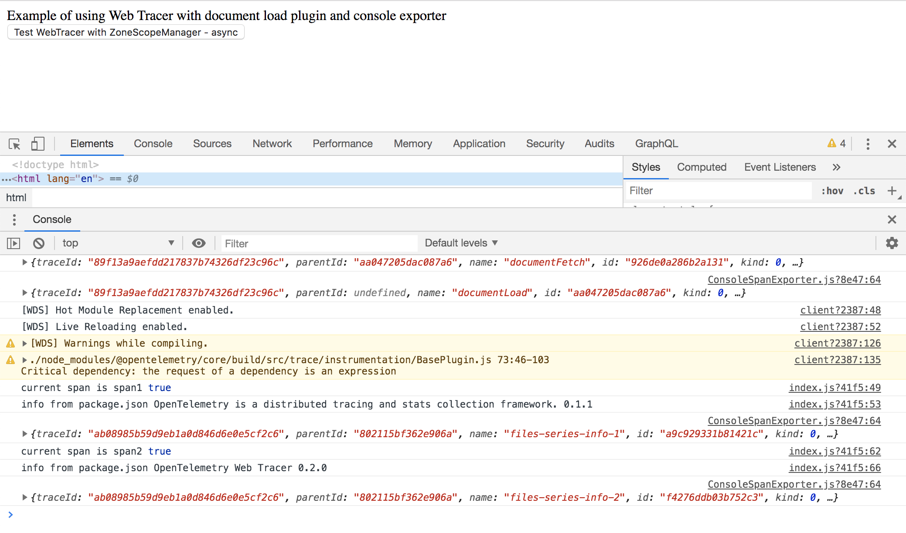

# Overview

This example shows how to use [@opentelemetry/web](https://github.com/open-telemetry/opentelemetry-js/tree/master/packages/opentelemetry-web) to instrument your JavaScript code running in the browser.
This example uses the `ConsoleSpanExporter()` to export spans to the browser console output.

## Installation

```sh
$ # from this directory
$ npm install
```

## Run the Application

```sh
$ # from this directory
$ npm start
```

By default, the application will run on port `8090`.

To see the results, open the browser at <http://localhost:8090/> and make sure you have the browser console open. The application is using the `ConsoleSpanExporter` and will post the created spans to the browser console.

The screen will look as follows:



## Useful links

- For more information on OpenTelemetry, visit: <https://opentelemetry.io/>
- For more information on web tracing, visit: <https://github.com/open-telemetry/opentelemetry-js/tree/master/packages/opentelemetry-web>

## LICENSE

Apache License 2.0
