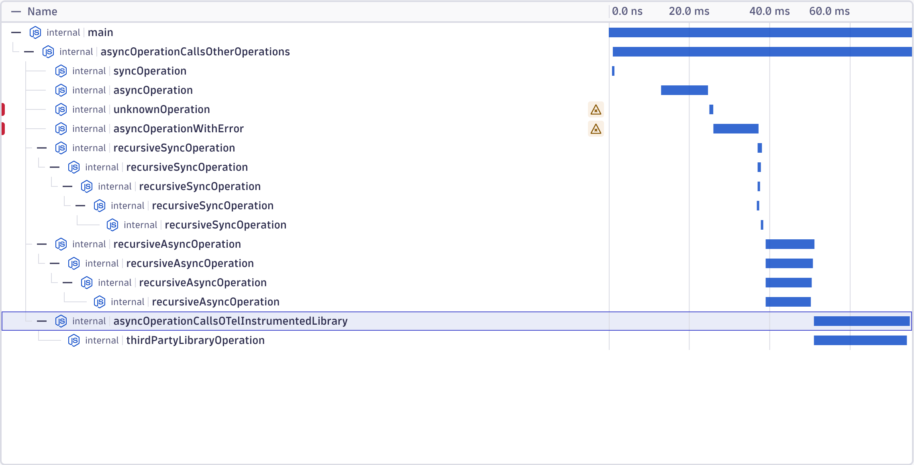

## Diagnostics Channel instrumentation example

This example demonstrates how to instrument a library that uses Node.js tracing channels with OpenTelemetry, without modifying the library itself.

**Layout:**
  - `instrumented-library.ts` - A library that publishes operations via `diagnostics_channel.tracingChannel()` (no OpenTelemetry dependencies)
  - `tracing-channel-instrumentation.ts` - OpenTelemetry instrumentation that subscribes to the tracing channel and creates spans
    - Uses `context.attach()` and `context.detach()` APIs for manual context propagation
  - `third-party-library.ts` - Simulates a library instrumented with traditional OpenTelemetry patching
  - `index.ts` - Main application that uses the instrumented library
  - `opentelemetry.ts` - OpenTelemetry SDK setup with OTLP and console exporters, also registers the tracing channel instrumentation

To run the example:
- `npm run compile` (from top-level, important as context operations are not available otherwise, they are not available on `main` yet)
- `npm run start` (you can set OTLP exporter env vars to point it to your backend of choice)

You should see properly parented spans for both tracing channel operations and nested traditionally-instrumented operations.

