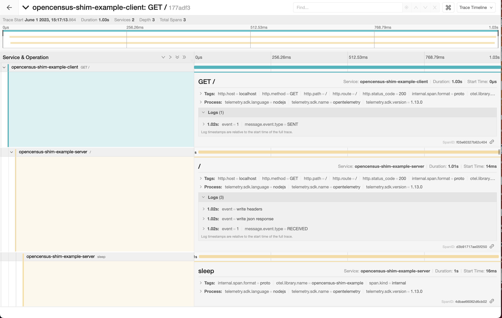

# Overview

The OpenCensus shim allows existing OpenCensus instrumentation to interoperate with OpenTelemetry instrumentation by using the OpenTelemetry SDK as an implementation for OpenCensus.

This is a simple example that demonstrates how existing OpenCensus instrumentation can be integrated with OpenTelemetry.

The example has:

- Root Spans (on client), instrumented with OpenCensus's HTTP instrumentation
- Child Span from a remote parent (on server), instrumented with OpenCensus's HTTP instrumentation
- Another Child Span created in the server representing some work being done, instrumented manually with OpenTelemetry.

## Installation

```sh
# from this directory
$ npm install
```

## Run the Application

### Jaeger

Setup [Jaeger Tracing All in One](https://www.jaegertracing.io/docs/latest/getting-started/#all-in-one) agent. If you have docker installed:

```sh
docker run \
  --rm \
  --name jaeger \
  -e COLLECTOR_OTLP_ENABLED=true \
  -p 16686:16686 \
  -p 4317:4317 \
  jaegertracing/all-in-one:latest
```

### Run the sample server

```sh
# from this directory
$ node -r @opentelemetry/shim-opencensus/register ./server.js
```

The `-r @opentelemetry/shim-opencensus/register` flag to Node tells it to load the OpenCensus
shim's register module to install the OpenCensus shim. The shim bridges all calls to
OpenCensus's tracers to OpenTelemetry.

### Run the sample client

```sh
# from this directory
node -r @opentelemetry/shim-opencensus/register ./client.js
```

Again, we use the `-r @opentelemetry/shim-opencensus/register` flag to install the OpenCensus shim.

## Check the trace

Go to Jaeger with your browser <http://localhost:16686/> and click on the "Service" dropdown. Choose `opencensus-shim-example-server` and hit "Find Traces". Click on one of the available traces and you should see 3 spans:

- An outer span from the client. This came from the OpenCensus HTTP instrumentation.
  - A child from the server. This came from the OpenCensus HTTP instrumentation.
    - A child for the sleep operation. This was manually instrumented with OpenTelemetry.
      Notice this span is correctly recorded as a child of the OpenCensus instrumentation.

<p align="center"></p>

## Useful links

- For more information on OpenTelemetry, visit: <https://opentelemetry.io/>
- For more information on OpenTelemetry for Node.js, visit: <https://github.com/open-telemetry/opentelemetry-js/tree/main/packages/opentelemetry-sdk-trace-node>
- For more information on OpenCensus, visit: <https://opencensus.io/>

## LICENSE

Apache License 2.0
