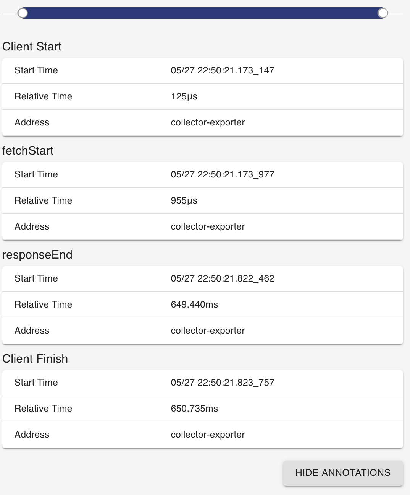

# OpenTelemetry Fetch Instrumentation for web

[![NPM Published Version][npm-img]][npm-url]
[![Apache License][license-image]][license-image]

This module provides auto instrumentation for web using fetch.

## Installation

```bash
npm install --save @opentelemetry/instrumentation-fetch
```

## Usage

```js
'use strict';
import { ConsoleSpanExporter, SimpleSpanProcessor } from '@opentelemetry/sdk-trace-base';
import { WebTracerProvider } from '@opentelemetry/sdk-trace-web';
import { FetchInstrumentation } from '@opentelemetry/instrumentation-fetch';
import { ZoneContextManager } from '@opentelemetry/context-zone';
import { registerInstrumentations } from '@opentelemetry/instrumentation';

const provider = new WebTracerProvider();

provider.addSpanProcessor(new SimpleSpanProcessor(new ConsoleSpanExporter()));

provider.register({
  contextManager: new ZoneContextManager(),
});

registerInstrumentations({
  instrumentations: [new FetchInstrumentation()],
});

// or plugin can be also initialised separately and then set the tracer provider or meter provider
const fetchInstrumentation = new FetchInstrumentation();
const provider = new WebTracerProvider();
provider.register({
  contextManager: new ZoneContextManager(),
});
fetchInstrumentation.setTracerProvider(provider);

provider.addSpanProcessor(new SimpleSpanProcessor(new ConsoleSpanExporter()));


// and some test

fetch('http://localhost:8090/fetch.js');

```

## Example Screenshots





See [examples/tracer-web/fetch](https://github.com/open-telemetry/opentelemetry-js/tree/main/examples/tracer-web) for a short example.

### Fetch Instrumentation options

Fetch instrumentation plugin has few options available to choose from. You can set the following:

| Options                                                                                                                                                                  | Type                          | Description                                                                             |
|--------------------------------------------------------------------------------------------------------------------------------------------------------------------------|-------------------------------|-----------------------------------------------------------------------------------------|
| [`applyCustomAttributesOnSpan`](https://github.com/open-telemetry/opentelemetry-js/blob/main/experimental/packages/opentelemetry-instrumentation-fetch/src/fetch.ts#L64) | `HttpCustomAttributeFunction` | Function for adding custom attributes                                                   |
| [`ignoreNetworkEvents`](https://github.com/open-telemetry/opentelemetry-js/blob/main/experimental/packages/opentelemetry-instrumentation-fetch/src/fetch.ts#L67)                      | `boolean`                     | Disable network events being added as span events (network events are added by default) |

## Useful links

- For more information on OpenTelemetry, visit: <https://opentelemetry.io/>
- For more about OpenTelemetry JavaScript: <https://github.com/open-telemetry/opentelemetry-js>
- For help or feedback on this project, join us in [GitHub Discussions][discussions-url]

## License

Apache 2.0 - See [LICENSE][license-url] for more information.

[discussions-url]: https://github.com/open-telemetry/opentelemetry-js/discussions
[license-url]: https://github.com/open-telemetry/opentelemetry-js/blob/main/LICENSE
[license-image]: https://img.shields.io/badge/license-Apache_2.0-green.svg?style=flat
[npm-url]: https://www.npmjs.com/package/@opentelemetry/instrumentation-fetch
[npm-img]: https://badge.fury.io/js/%40opentelemetry%2Finstrumentation-fetch.svg
