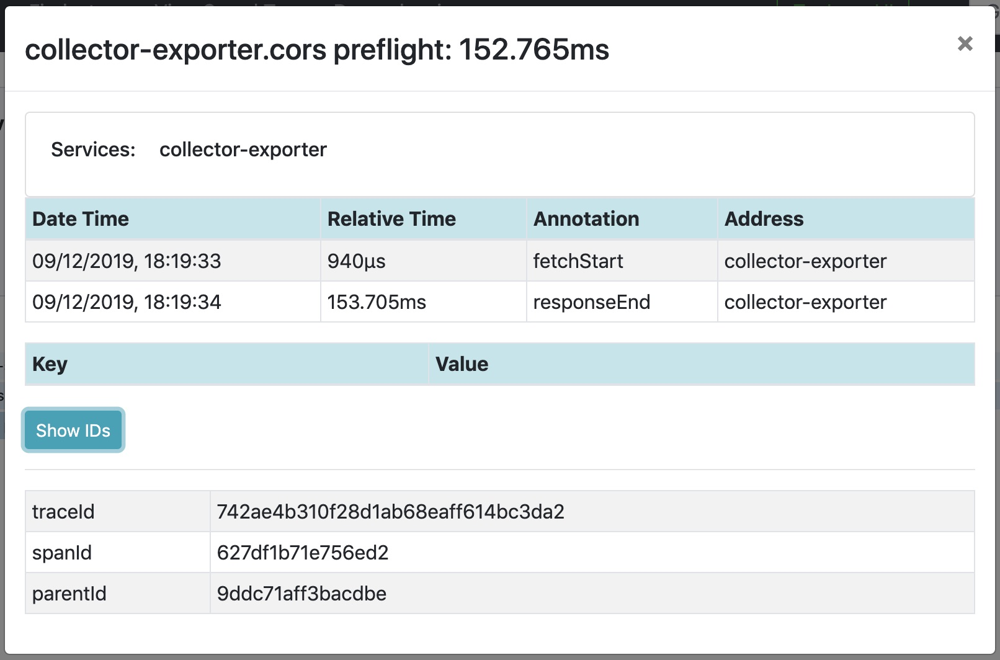

# OpenTelemetry XMLHttpRequest Instrumentation for web

[![NPM Published Version][npm-img]][npm-url]
[![Apache License][license-image]][license-image]

**Note: This is an experimental package. New releases may include breaking changes.**

This module provides auto instrumentation for web using XMLHttpRequest.

## Installation

```bash
npm install --save @opentelemetry/instrumentation-xml-http-request
```

## Usage

```js
import {
  ConsoleSpanExporter,
  SimpleSpanProcessor,
  WebTracerProvider,
} from '@opentelemetry/sdk-trace-web';
import { XMLHttpRequestInstrumentation } from '@opentelemetry/instrumentation-xml-http-request';
import { ZoneContextManager } from '@opentelemetry/context-zone';
import { registerInstrumentations } from '@opentelemetry/instrumentation';

const providerWithZone = new WebTracerProvider({
  spanProcessors: [new SimpleSpanProcessor(new ConsoleSpanExporter())]
});

providerWithZone.register({
  contextManager: new ZoneContextManager(),
});

registerInstrumentations({
  instrumentations: [
    new XMLHttpRequestInstrumentation({
      propagateTraceHeaderCorsUrls: ['http://localhost:8090']
    }),
  ],
});


const webTracerWithZone = providerWithZone.getTracer('default');

/////////////////////////////////////////

// or plugin can be also initialised separately and then set the tracer provider or meter provider
const xmlHttpRequestInstrumentation = new XMLHttpRequestInstrumentation({
  propagateTraceHeaderCorsUrls: ['http://localhost:8090']
});
const providerWithZone = new WebTracerProvider();
providerWithZone.register({
  contextManager: new ZoneContextManager(),
});
xmlHttpRequestInstrumentation.setTracerProvider(providerWithZone);
/////////////////////////////////////////


// and some test
const req = new XMLHttpRequest();
req.open('GET', 'http://localhost:8090/xml-http-request.js', true);
req.send();
```

### XHR Instrumentation options

XHR instrumentation plugin has few options available to choose from. You can set the following:

| Options                       | Type                         | Description |
| ----------------------------- | ---------------------------- | ----------- |
| `applyCustomAttributesOnSpan` | `XHRCustomAttributeFunction` | Function for adding custom attributes |
| `ignoreNetworkEvents`         | boolean                      | Disable network events being added as span events (network events are added by default) |
| `measureRequestSize`          | boolean                      | Measure outgoing request length (outgoing request length is not measured by default) |
| `semconvStabilityOptIn`       | string                       | A comma-separated string of tokens as described for `OTEL_SEMCONV_STABILITY_OPT_IN` in the [HTTP semantic convention stability migration](https://github.com/open-telemetry/semantic-conventions/blob/main/docs/non-normative/http-migration.md) guide. See the "Semantic Conventions" section below. |

## Semantic Conventions

Up to and including v0.200.0, `instrumentation-xml-http-request` generates telemetry using [Semantic Conventions v1.7.0](https://github.com/open-telemetry/opentelemetry-specification/blob/v1.7.0/semantic_conventions/README.md).

HTTP semantic conventions (semconv) were stabilized in semconv v1.23.0, and a [migration process](https://github.com/open-telemetry/semantic-conventions/blob/main/docs/non-normative/http-migration.md#http-semantic-convention-stability-migration) was defined. `instrumentation-xml-http-request` versions 0.201.0 and later include support for migrating to stable HTTP semantic conventions, as described below. The intent is to provide an approximate 6 month time window for users of this instrumentation to migrate to the new HTTP semconv, after which a new minor version will change to use the *new* semconv by default and drop support for the old semconv. See the [HTTP semconv migration plan for OpenTelemetry JS instrumentations](https://github.com/open-telemetry/opentelemetry-js/issues/5646).

To select which semconv version(s) is emitted from this instrumentation, use the `semconvStabilityOptIn` configuration option. This option works [as described for `OTEL_SEMCONV_STABILITY_OPT_IN`](https://github.com/open-telemetry/semantic-conventions/blob/main/docs/non-normative/http-migration.md):

- `http`: emit the new (stable) v1.23.0 semantics
- `http/dup`: emit **both** the old v1.7.0 and the new (stable) v1.23.0 semantics
- By default, if `semconvStabilityOptIn` includes neither of the above tokens, the old v1.7.0 semconv is used.

**Span status:** When the stable semconv is selected, the [span status](https://github.com/open-telemetry/semantic-conventions/blob/main/docs/http/http-spans.md#status) is set to ERROR when the response status code is `>=400` or when the response fails with an 'error' or 'timeout' XHR event. When just the old semconv is select, the span status is not set.

**Span attributes:**

| v1.7.0 semconv         | v1.23.0 semconv                    | Notes |
| ---------------------- | ---------------------------------- | ----- |
| `http.method`          | `http.request.method`              | HTTP request method. With v1.23.0 semconv [`http.request.method_original` may also be included](https://github.com/open-telemetry/semantic-conventions/blob/v1.23.1/docs/http/http-spans.md#common-attributes). |
| `http.url`             | `url.full`                         | Full HTTP request URL |
| `http.host`            | `server.address` and `server.port` | The hostname and port of the request URL |
| `http.status_code`     | `http.response.status_code`        | HTTP response status code |
| `http.request_content_length_uncompressed` | `http.request.body.size` | This is only added if `measureRequestSize` is `true`. |
| `http.response_content_length_uncompressed` | (not included) | Stable HTTP semconv would use `http.response.body.size`, but this is an [`Opt-In` attribute](https://github.com/open-telemetry/semantic-conventions/blob/v1.23.1/docs/http/http-spans.md#http-client), so would require adding a configuration option to this instrumentation to enable. |
| `http.response_content_length` | (not included)              | Stable HTTP semconv would use `http.response.header.<key>`, but this is an [`Opt-In` attribute](https://github.com/open-telemetry/semantic-conventions/blob/v1.23.1/docs/http/http-spans.md#http-client), so would require adding a configuration option to this instrumentation to enable. |
| (no equivalent)        | `error.type`                       | The response status (as a string), if the response status was `>=400`, or one of these possible request errors: 'timeout' and 'error'.|
| `http.user_agent`      | (not included)                     | Stable HTTP semconv would use `user_agent.original`, but this is an [`Opt-In` attribute](https://github.com/open-telemetry/semantic-conventions/blob/v1.23.1/docs/http/http-spans.md#http-client), so would require adding a configuration option to this instrumentation to enable. |
| `http.scheme`          | (not included)                     | Stable HTTP semconv would use `url.scheme`, but this is an [`Opt-In` attribute](https://github.com/open-telemetry/semantic-conventions/blob/v1.23.1/docs/http/http-spans.md#http-client), so would require adding a configuration option to this instrumentation to enable. |
| `http.status_text`     | (not included)                     | This is no longer a documented semantic conventions attribute. |

## Example Screenshots




See [examples/tracer-web](https://github.com/open-telemetry/opentelemetry-js/tree/main/examples/tracer-web) for a short example.

## Useful links

- For more information on OpenTelemetry, visit: <https://opentelemetry.io/>
- For more about OpenTelemetry JavaScript: <https://github.com/open-telemetry/opentelemetry-js>
- For help or feedback on this project, join us in [GitHub Discussions][discussions-url]

## License

Apache 2.0 - See [LICENSE][license-url] for more information.

[discussions-url]: https://github.com/open-telemetry/opentelemetry-js/discussions
[license-url]: https://github.com/open-telemetry/opentelemetry-js/blob/main/LICENSE
[license-image]: https://img.shields.io/badge/license-Apache_2.0-green.svg?style=flat
[npm-url]: https://www.npmjs.com/package/@opentelemetry/instrumentation-xml-http-request
[npm-img]: https://badge.fury.io/js/%40opentelemetry%2Finstrumentation-xml-http-request.svg
