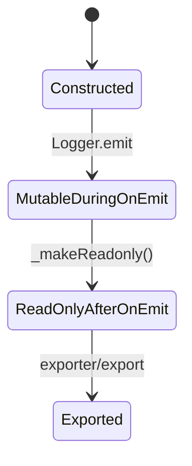
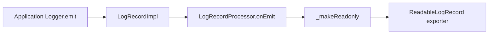
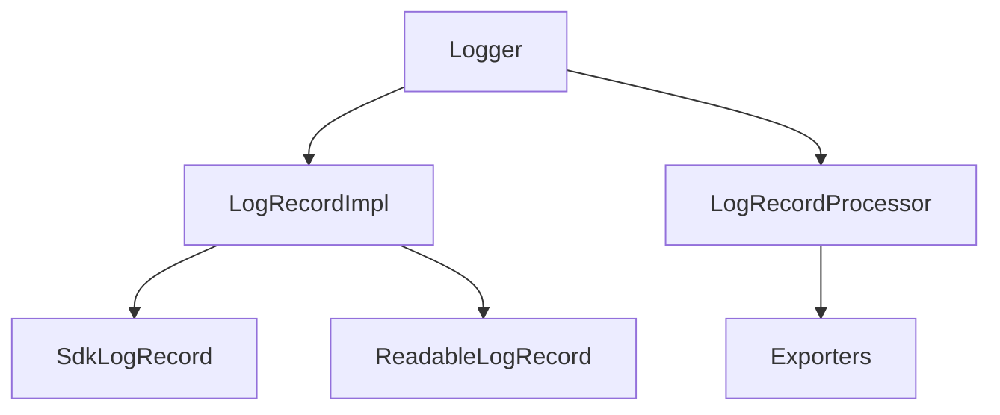
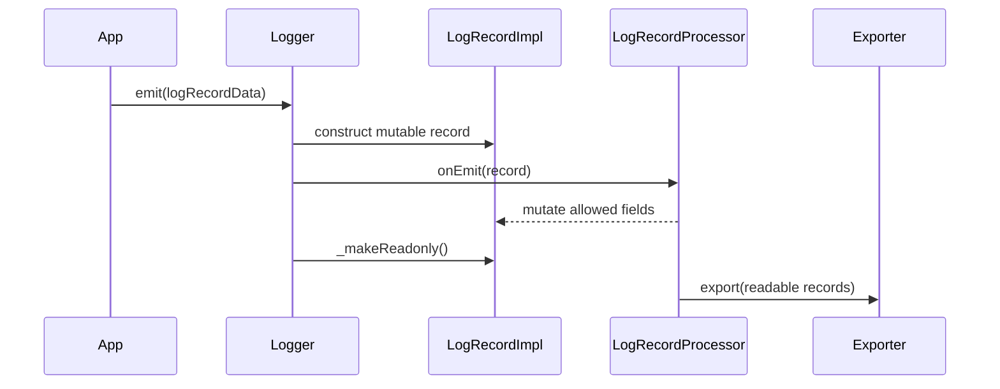

# sdk-logs

## Overview
`@opentelemetry/sdk-logs` owns log-record creation, in-process mutation during `onEmit`, read-only handoff after emission, and exporter-facing readable records.

## Key Components
- `src/Logger.ts`: creates `LogRecordImpl`, sends it through processors, then flips it to read-only.
- `src/LogRecordImpl.ts`: mutable log-record implementation used during processor execution.
- `src/export/SdkLogRecord.ts`: public mutable processor contract.
- `src/export/ReadableLogRecord.ts`: exporter-facing read-only contract.
- `src/export/*Processor*.ts`: synchronous and batched processor implementations.

## Diagrams (Mermaid)

### State Diagram

### Data Flow Diagram

### Component Diagram

### Sequence Diagram

