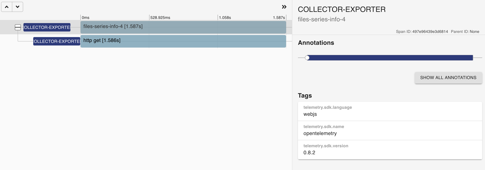
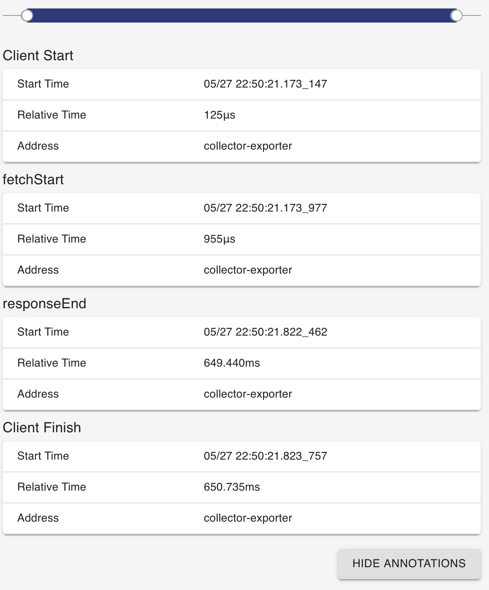
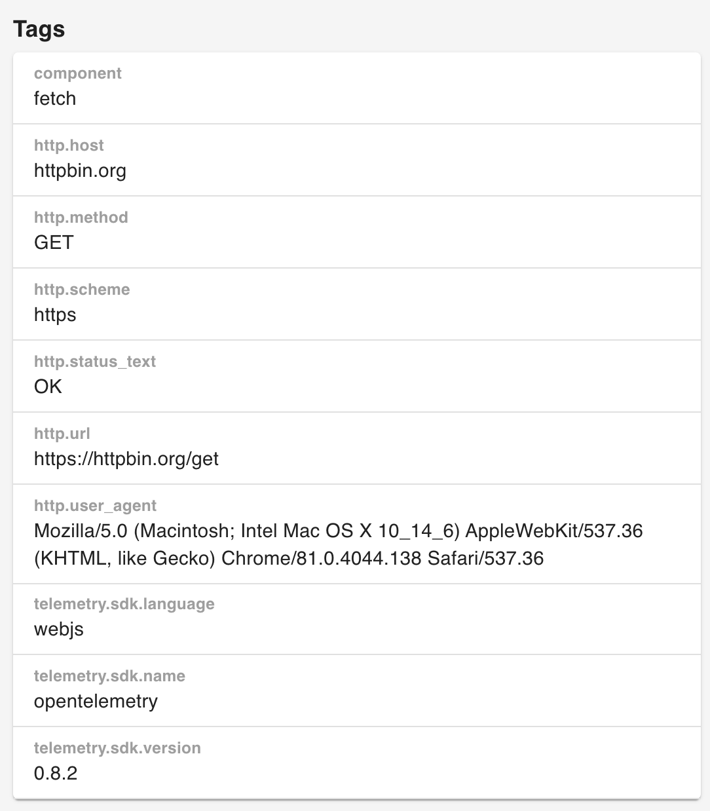

# OpenTelemetry Fetch Instrumentation for web

[![Gitter chat][gitter-image]][gitter-url]
[![NPM Published Version][npm-img]][npm-url]
[![dependencies][dependencies-image]][dependencies-url]
[![devDependencies][devDependencies-image]][devDependencies-url]
[![Apache License][license-image]][license-image]

This module provides auto instrumentation for web using fetch.

## Installation

```bash
npm install --save @opentelemetry/instrumentation-fetch
```

## Usage

```js
'use strict';
import { ConsoleSpanExporter, SimpleSpanProcessor } from '@opentelemetry/tracing';
import { WebTracerProvider } from '@opentelemetry/web';
import { FetchInstrumentation } from '@opentelemetry/instrumentation-fetch';
import { ZoneContextManager } from '@opentelemetry/context-zone';

const provider = new WebTracerProvider({
  plugins: [
    new FetchInstrumentation(),
  ],
});

provider.addSpanProcessor(new SimpleSpanProcessor(new ConsoleSpanExporter()));

provider.register({
  contextManager: new ZoneContextManager(),
});

// or plugin can be also initialised separately and then set the tracer provider or meter provider
const fetchInstrumentation = new FetchInstrumentation();
const provider = new WebTracerProvider();
provider.register({
  contextManager: new ZoneContextManager(),
});
fetchInstrumentation.setTracerProvider(provider);

provider.addSpanProcessor(new SimpleSpanProcessor(new ConsoleSpanExporter()));


// and some test

fetch('http://localhost:8090/fetch.js');

```

## Example Screenshots





See [examples/tracer-web/fetch](https://github.com/open-telemetry/opentelemetry-js/tree/main/examples/tracer-web) for a short example.

## Useful links

- For more information on OpenTelemetry, visit: <https://opentelemetry.io/>
- For more about OpenTelemetry JavaScript: <https://github.com/open-telemetry/opentelemetry-js>
- For help or feedback on this project, join us on [gitter][gitter-url]

## License

Apache 2.0 - See [LICENSE][license-url] for more information.

[gitter-image]: https://badges.gitter.im/open-telemetry/opentelemetry-js.svg
[gitter-url]: https://gitter.im/open-telemetry/opentelemetry-node?utm_source=badge&utm_medium=badge&utm_campaign=pr-badge&utm_content=badge
[license-url]: https://github.com/open-telemetry/opentelemetry-js/blob/main/LICENSE
[license-image]: https://img.shields.io/badge/license-Apache_2.0-green.svg?style=flat
[dependencies-image]: https://david-dm.org/open-telemetry/opentelemetry-js/status.svg?path=packages/opentelemetry-instrumentation-fetch
[dependencies-url]: https://david-dm.org/open-telemetry/opentelemetry-js?path=packages%2Fopentelemetry-instrumentation-fetch
[devDependencies-image]: https://david-dm.org/open-telemetry/opentelemetry-js/dev-status.svg?path=packages/opentelemetry-instrumentation-fetch
[devDependencies-url]: https://david-dm.org/open-telemetry/opentelemetry-js?path=packages%2Fopentelemetry-instrumentation-fetch&type=dev
[npm-url]: https://www.npmjs.com/package/@opentelemetry/instrumentation-fetch
[npm-img]: https://badge.fury.io/js/%40opentelemetry%2Finstrumentation-fetch.svg
