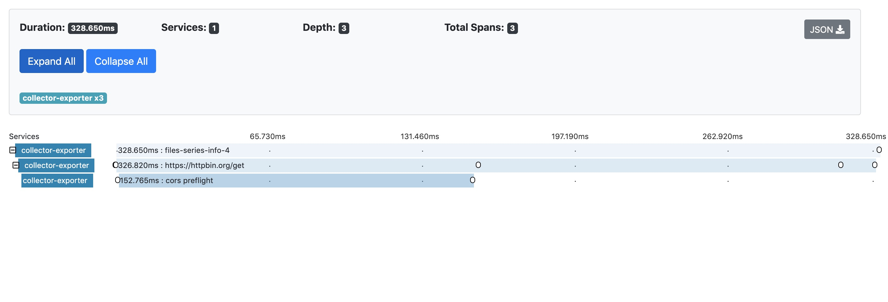

# OpenTelemetry XMLHttpRequest Instrumentation for web

[![NPM Published Version][npm-img]][npm-url]
[![dependencies][dependencies-image]][dependencies-url]
[![devDependencies][devDependencies-image]][devDependencies-url]
[![Apache License][license-image]][license-image]

This module provides auto instrumentation for web using XMLHttpRequest .

## Installation

```bash
npm install --save @opentelemetry/instrumentation-xml-http-request
```

## Usage

```js
import { ConsoleSpanExporter, SimpleSpanProcessor } from '@opentelemetry/tracing';
import { WebTracerProvider } from '@opentelemetry/web';
import { XMLHttpRequestInstrumentation } from '@opentelemetry/instrumentation-xml-http-request';
import { ZoneContextManager } from '@opentelemetry/context-zone';
import { registerInstrumentations } from '@opentelemetry/instrumentation';

const providerWithZone = new WebTracerProvider();
providerWithZone.addSpanProcessor(new SimpleSpanProcessor(new ConsoleSpanExporter()));

providerWithZone.register({
  contextManager: new ZoneContextManager(),
});

registerInstrumentations({
  instrumentations: [
    new XMLHttpRequestInstrumentation({
      propagateTraceHeaderCorsUrls: ['http://localhost:8090']
    }),
  ],
  tracerProvider: provider,
});


const webTracerWithZone = providerWithZone.getTracer('default');

/////////////////////////////////////////

// or plugin can be also initialised separately and then set the tracer provider or meter provider
const xmlHttpRequestInstrumentation = new XMLHttpRequestInstrumentation({
  propagateTraceHeaderCorsUrls: ['http://localhost:8090']
});
const providerWithZone = new WebTracerProvider();
providerWithZone.register({
  contextManager: new ZoneContextManager(),
});
xmlHttpRequestInstrumentation.setTracerProvider(providerWithZone);
/////////////////////////////////////////


// and some test
const req = new XMLHttpRequest();
req.open('GET', 'http://localhost:8090/xml-http-request.js', true);
req.send();

```

## Example Screenshots




See [examples/tracer-web](https://github.com/open-telemetry/opentelemetry-js/tree/main/examples/tracer-web) for a short example.

## Useful links

- For more information on OpenTelemetry, visit: <https://opentelemetry.io/>
- For more about OpenTelemetry JavaScript: <https://github.com/open-telemetry/opentelemetry-js>
- For help or feedback on this project, join us in [GitHub Discussions][discussions-url]

## License

Apache 2.0 - See [LICENSE][license-url] for more information.

[discussions-url]: https://github.com/open-telemetry/opentelemetry-js/discussions
[license-url]: https://github.com/open-telemetry/opentelemetry-js/blob/main/LICENSE
[license-image]: https://img.shields.io/badge/license-Apache_2.0-green.svg?style=flat
[dependencies-image]: https://status.david-dm.org/gh/open-telemetry/opentelemetry-js.svg?path=packages%2Fopentelemetry-instrumentation-xml-http-request
[dependencies-url]: https://david-dm.org/open-telemetry/opentelemetry-js?path=packages%2Fopentelemetry-instrumentation-xml-http-request
[devDependencies-image]: https://status.david-dm.org/gh/open-telemetry/opentelemetry-js.svg?path=packages%2Fopentelemetry-instrumentation-xml-http-request&type=dev
[devDependencies-url]: https://david-dm.org/open-telemetry/opentelemetry-js?path=packages%2Fopentelemetry-instrumentation-xml-http-request&type=dev
[npm-url]: https://www.npmjs.com/package/@opentelemetry/instrumentation-xml-http-request
[npm-img]: https://badge.fury.io/js/%40opentelemetry%2Finstrumentation-xml-http-request.svg
