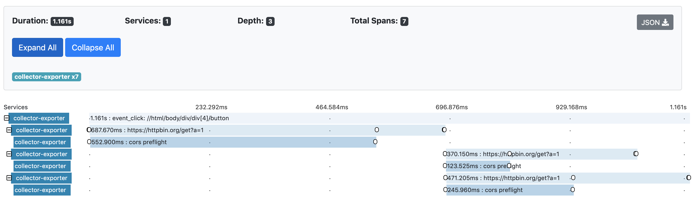
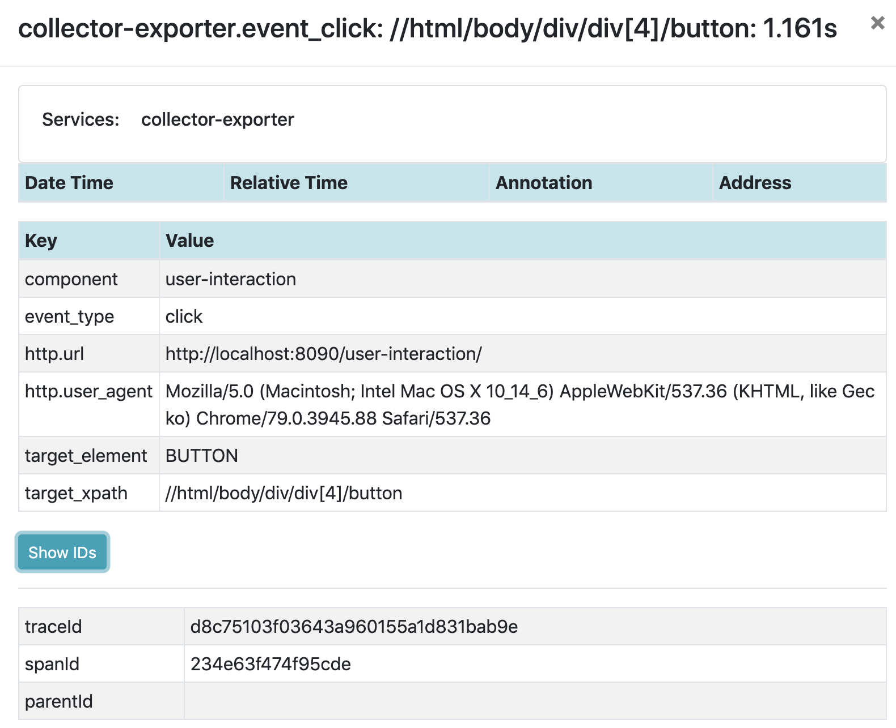
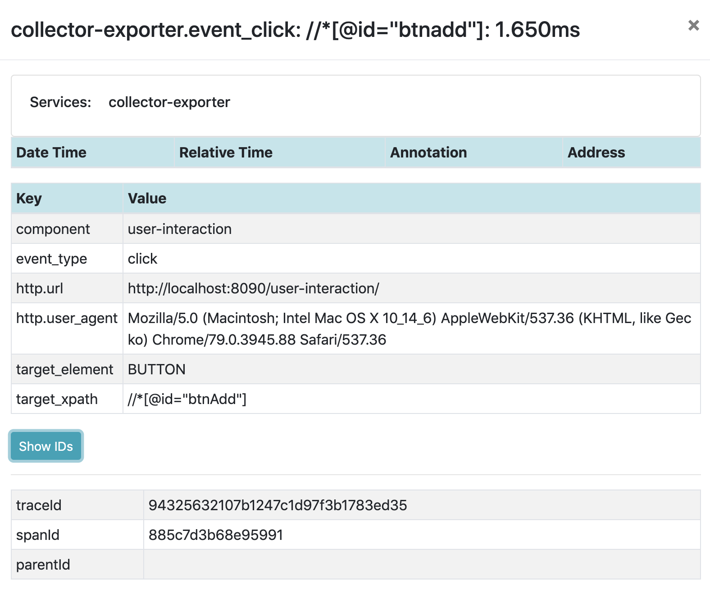

# OpenTelemetry UserInteraction Plugin for web
[![Gitter chat][gitter-image]][gitter-url]
[![NPM Published Version][npm-img]][npm-url]
[![dependencies][dependencies-image]][dependencies-url]
[![devDependencies][devDependencies-image]][devDependencies-url]
[![Apache License][license-image]][license-image]

This module provides auto instrumentation of user interaction for web.
This module can work either with [zone-js] or without it.
With [zone-js] and ZoneContextManager it will fully support the async operations.
If you use Angular you already have the [zone-js]. It will be the same if you use [@opentelemetry/context-zone].
Without [zone-js] it will still work but with limited support.

## Installation

```bash
npm install --save @opentelemetry/plugin-user-interaction
```

## Usage

```js
import { ConsoleSpanExporter, SimpleSpanProcessor } from '@opentelemetry/tracing';
import { WebTracerProvider } from '@opentelemetry/web';
import { UserInteractionPlugin } from '@opentelemetry/plugin-user-interaction';
import { ZoneContextManager } from '@opentelemetry/context-zone';
// or if you already have zone.js
// import { ZoneContextManager } from '@opentelemetry/context-zone-peer-dep';

const provider = new WebTracerProvider({
  contextManager: new ZoneContextManager(), // optional
  plugins: [
    new UserInteractionPlugin()
  ]
});
provider.addSpanProcessor(new SimpleSpanProcessor(new ConsoleSpanExporter()));

// and some test
const btn1 = document.createElement('button');
btn1.append(document.createTextNode('btn1'));
btn1.addEventListener('click', () => {
  console.log('clicked');
});
document.querySelector('body').append(btn1);

const btn2 = document.createElement('button');
btn2.append(document.createTextNode('btn2'));
btn2.addEventListener('click', () => {
  getData('https://httpbin.org/get').then(() => {
    getData('https://httpbin.org/get').then(() => {
      console.log('data downloaded 2');
    });
    getData('https://httpbin.org/get').then(() => {
      console.log('data downloaded 3');
    });
    console.log('data downloaded 1');
  });
});
document.querySelector('body').append(btn2);

function getData(url) {
  return new Promise(async (resolve) => {
    const req = new XMLHttpRequest();
    req.open('GET', url, true);
    req.setRequestHeader('Content-Type', 'application/json');
    req.setRequestHeader('Accept', 'application/json');
    req.send();
    req.onload = function () {
      resolve();
    };
  });
}

// now click on buttons

```

## Example Screenshots





## Useful links
- For more information on OpenTelemetry, visit: <https://opentelemetry.io/>
- For more about OpenTelemetry JavaScript: <https://github.com/open-telemetry/opentelemetry-js>
- For help or feedback on this project, join us on [gitter][gitter-url]

## License

Apache 2.0 - See [LICENSE][license-url] for more information.

[gitter-image]: https://badges.gitter.im/open-telemetry/opentelemetry-js.svg
[gitter-url]: https://gitter.im/open-telemetry/opentelemetry-node?utm_source=badge&utm_medium=badge&utm_campaign=pr-badge&utm_content=badge
[license-url]: https://github.com/open-telemetry/opentelemetry-js/blob/master/LICENSE
[license-image]: https://img.shields.io/badge/license-Apache_2.0-green.svg?style=flat
[dependencies-image]: https://david-dm.org/open-telemetry/opentelemetry-js/status.svg?path=packages/opentelemetry-plugin-user-interaction
[dependencies-url]: https://david-dm.org/open-telemetry/opentelemetry-js?path=packages%2Fopentelemetry-plugin-user-interaction
[devDependencies-image]: https://david-dm.org/open-telemetry/opentelemetry-js/dev-status.svg?path=packages/opentelemetry-plugin-user-interaction
[devDependencies-url]: https://david-dm.org/open-telemetry/opentelemetry-js?path=packages%2Fopentelemetry-plugin-user-interaction&type=dev
[npm-url]: https://www.npmjs.com/package/@opentelemetry/plugin-user-interaction
[npm-img]: https://badge.fury.io/js/%40opentelemetry%2Fplugin-user-interaction.svg
[zone-js]: https://www.npmjs.com/package/zone.js
[@opentelemetry/context-zone]: https://www.npmjs.com/package/@opentelemetry/context-zone

