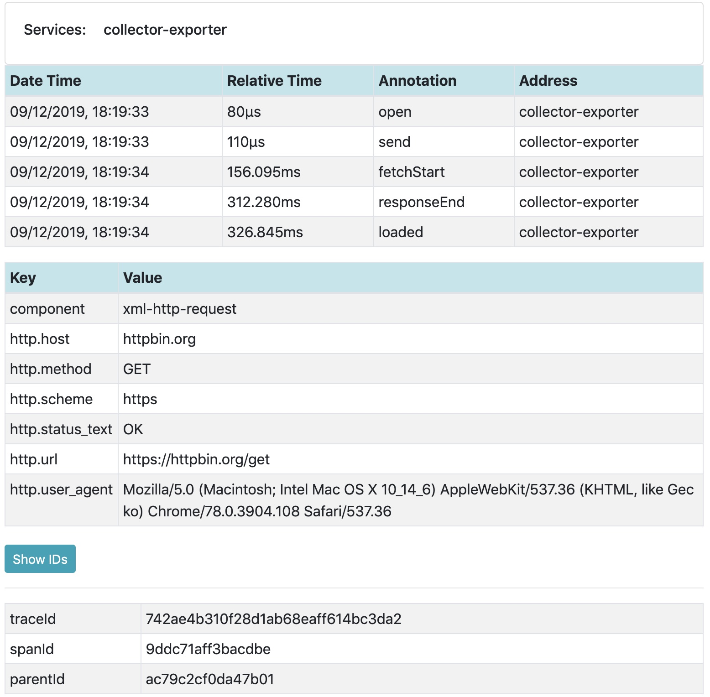
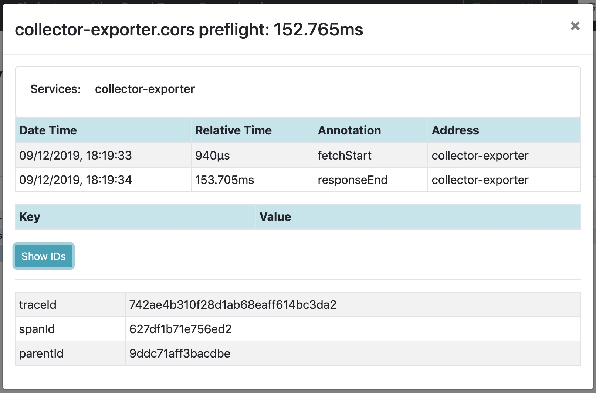

# OpenTelemetry XMLHttpRequest Instrumentation for web
[![Gitter chat][gitter-image]][gitter-url]
[![NPM Published Version][npm-img]][npm-url]
[![dependencies][dependencies-image]][dependencies-url]
[![devDependencies][devDependencies-image]][devDependencies-url]
[![Apache License][license-image]][license-image]

This module provides auto instrumentation for web using XMLHttpRequest .

## Installation

```bash
npm install --save @opentelemetry/plugin-xml-http-request
```

## Usage

```js
import { ConsoleSpanExporter, SimpleSpanProcessor } from '@opentelemetry/tracing';
import { WebTracer } from '@opentelemetry/web';
import { XMLHttpRequestPlugin } from '@opentelemetry/plugin-xml-http-request';
import { ZoneScopeManager } from '@opentelemetry/scope-zone';

const webTracerWithZone = new WebTracer({
  scopeManager: new ZoneScopeManager(),
  plugins: [
    new XMLHttpRequestPlugin({
      propagateTraceHeaderCorsUrls: ['http://localhost:8090']    
    })
  ]
});
webTracerWithZone.addSpanProcessor(new SimpleSpanProcessor(new ConsoleSpanExporter()));

// and some test
const req = new XMLHttpRequest();
req.open('GET', 'http://localhost:8090/xml-http-request.js', true);
req.send();

```

## Example Screenshots




## Useful links
- For more information on OpenTelemetry, visit: <https://opentelemetry.io/>
- For more about OpenTelemetry JavaScript: <https://github.com/open-telemetry/opentelemetry-js>
- For help or feedback on this project, join us on [gitter][gitter-url]

## License

Apache 2.0 - See [LICENSE][license-url] for more information.

[gitter-image]: https://badges.gitter.im/open-telemetry/opentelemetry-js.svg
[gitter-url]: https://gitter.im/open-telemetry/opentelemetry-node?utm_source=badge&utm_medium=badge&utm_campaign=pr-badge&utm_content=badge
[license-url]: https://github.com/open-telemetry/opentelemetry-js/blob/master/LICENSE
[license-image]: https://img.shields.io/badge/license-Apache_2.0-green.svg?style=flat
[dependencies-image]: https://david-dm.org/open-telemetry/opentelemetry-js/status.svg?path=packages/opentelemetry-plugin-xml-http-request
[dependencies-url]: https://david-dm.org/open-telemetry/opentelemetry-js?path=packages%2Fopentelemetry-plugin-xml-http-request
[devDependencies-image]: https://david-dm.org/open-telemetry/opentelemetry-js/dev-status.svg?path=packages/opentelemetry-plugin-xml-http-request
[devDependencies-url]: https://david-dm.org/open-telemetry/opentelemetry-js?path=packages%2Fopentelemetry-plugin-xml-http-request&type=dev
[npm-url]: https://www.npmjs.com/package/@opentelemetry/plugin-xml-http-request
[npm-img]: https://badge.fury.io/js/%40opentelemetry%plugin-xml-http-request.svg
