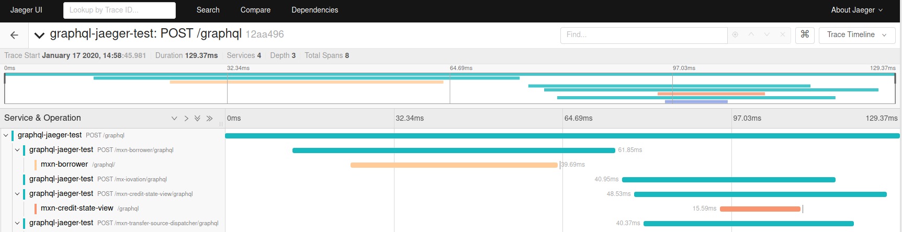

# OpenTelemetry Propagator Jaeger

[![NPM Published Version][npm-img]][npm-url]
[![dependencies][dependencies-image]][dependencies-url]
[![devDependencies][devDependencies-image]][devDependencies-url]
[![Apache License][license-image]][license-image]

OpenTelemetry Jaeger propagator provides HTTP header propagation for systems that are using Jaeger HTTP header format.

Format:
{trace-id}:{span-id}:{parent-span-id}:{flags}

* {trace-id}
  * 64-bit or 128-bit random number in base16 format.
  * Can be variable length, shorter values are 0-padded on the left.
  * Value of 0 is invalid.

* {span-id}
  * 64-bit random number in base16 format.

* {parent-span-id}
  * Set to 0 because this field is deprecated.
* {flags}
  * One byte bitmap, as two hex digits.

Example of usage:

```javascript
const { NodeTracerProvider } = require('@opentelemetry/sdk-trace-node');
const { JaegerPropagator } = require('@opentelemetry/propagator-jaeger');

const provider = new NodeTracerProvider();
provider.register({
  propagator: new JaegerPropagator()
});
```

## Baggage Notes

Jeager Baggage is represented as multiple headers where the names are carrier dependent. For this reason, they are omitted from the `fields` method. This behavior should be taken into account if your application relies on the `fields` functionality. See the [specification][fields-spec-url] for more details.

## Trace on Jaeger UI



## Useful links

* For more information on OpenTelemetry, visit: <https://opentelemetry.io/>
* For more about OpenTelemetry JavaScript: <https://github.com/open-telemetry/opentelemetry-js>
* For help or feedback on this project, join us in [GitHub Discussions][discussions-url]

## License

Apache 2.0 - See [LICENSE][license-url] for more information.

[discussions-url]: https://github.com/open-telemetry/opentelemetry-js/discussions
[license-url]: https://github.com/open-telemetry/opentelemetry-js/blob/main/LICENSE
[license-image]: https://img.shields.io/badge/license-Apache_2.0-green.svg?style=flat
[dependencies-image]: https://david-dm.org/open-telemetry/opentelemetry-js/status.svg?path=packages/opentelemetry-propagator-jaeger
[dependencies-url]: https://david-dm.org/open-telemetry/opentelemetry-js?path=packages%2Fopentelemetry-propagator-jaeger
[devDependencies-image]: https://david-dm.org/open-telemetry/opentelemetry-js/dev-status.svg?path=packages/opentelemetry-propagator-jaeger
[devDependencies-url]: https://david-dm.org/open-telemetry/opentelemetry-js?path=packages%2Fopentelemetry-propagator-jaeger&type=dev
[npm-url]: https://www.npmjs.com/package/@opentelemetry/propagator-jaeger
[npm-img]: https://badge.fury.io/js/%40opentelemetry%2Fpropagator-jaeger.svg
[fields-spec-url]: https://github.com/open-telemetry/opentelemetry-specification/blob/master/specification/context/api-propagators.md#fields
